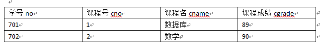

# MySQL安装

## 打开源列表文件
```c
sudo vim /etc/apt/souces.list(注意vim后面要有空格)
```
## 将源列表中的东西删掉 粘贴下列的代码
```c
deb http://mirrors.aliyun.com/ubuntu/ xenial main restricted universe multiverse
deb http://mirrors.aliyun.com/ubuntu/ xenial-security main restricted universe multiverse
deb http://mirrors.aliyun.com/ubuntu/ xenial-updates main restricted universe multiverse
deb http://mirrors.aliyun.com/ubuntu/ xenial-backports main restricted universe multiverse
##测试版源
deb http://mirrors.aliyun.com/ubuntu/ xenial-proposed main restricted universe multiverse
# 源码
deb-src http://mirrors.aliyun.com/ubuntu/ xenial main restricted universe multiverse
deb-src http://mirrors.aliyun.com/ubuntu/ xenial-security main restricted universe multiverse
deb-src http://mirrors.aliyun.com/ubuntu/ xenial-updates main restricted universe multiverse
deb-src http://mirrors.aliyun.com/ubuntu/ xenial-backports main restricted universe multiverse
##测试版源
deb-src http://mirrors.aliyun.com/ubuntu/ xenial-proposed main restricted universe multiverse
# Canonical 合作伙伴和附加
deb http://archive.canonical.com/ubuntu/ xenial partner
deb http://extras.ubuntu.com/ubuntu/ xenial main
```
## 安装sql语句
```c
sudo apt-get update 更新源
sudo apt-get install mysql-client mysql-server 安装mysql服务器和客户端
sudo /etc/init.d/mysqld start 启动mysql服务
```
## apache 安装
```c
sudo apt-get update
sudo apt-get install tasksel
sudo tasksel
```
# 数据库设计
* information表中数据信息如图：


* information表数据结构：

|中文名称 | 表名     | 字段属性 | 默认值 | 备注  |
|--------|---------|---------|-------|-------|
|学号|no|int （14）|000|主键 不能为null|
|姓名|name|varchar （20）||不能为null|
|性别|sex|varchar （20）||不能为null|
|年龄|age|varchar （20）||不能为null|
|系名|sdept|varchar （20）||不能为null|


* school表中数据信息如图：


* school表数据结构：

|中文名称 | 表名     | 字段属性 | 默认值 | 备注  |
|--------|---------|---------|-------|-------|
|系号|sno|int （14）|000|主键 不能为null|
|系名|sdept|varchar （20）||不能为null|


* score表中数据信息如图：


* score表数据结构：

|中文名称 | 表名     | 字段属性 | 默认值 | 备注  |
|--------|---------|---------|-------|-------|
|学号|no|int （14）|000|不能为null|
|课程号|cno|int （14）|000|主键 不能为null|
|课程名|cname|varchar （20）||不能为null|
|课程成绩|cgrade|varchar （20）||不能为null|

# sql数据库中的各种命令
1.创建数据库
```sql
create database stu;
```
2.显示数据库
```sql
show databases ;(注意有s)
```
3.创建表
```sql
create table information(
     no int(14) primary key,name varchar(20) not null,sex varchar(20) not null,age int(14) not null,sdept varchar(20) not null
     )
     ;
create table school(
     sno int(14) primary key,sdept varchar(20) not null
     )
     ;
create table score(
     no int(14) not null, cno int(14) primary key,cname varchar(20) not null,cgrade int(14) not null
     )
     ;

```
4.在表中插入数据
```sql
insert into information values(0701,'zhangsan','nv',20,'CS');
```
5.查询表中数据
```sql
select * from information;
```
6.修改表中数据
```sql
update information set name='Mary' where no=701;
```
7.删除表
```sql
drop table information;
```
8.删除表中数据
```sql
delete from information where no=701;
```
 

